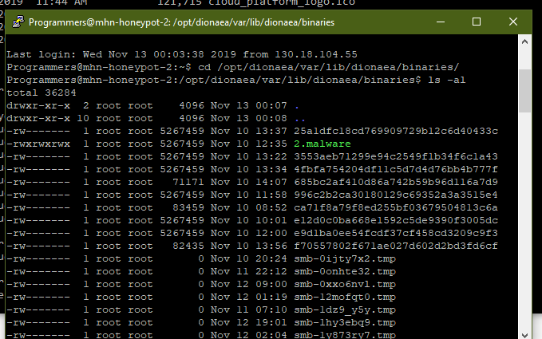

# Week 9 - Honeypot

Time spent: 24 hours spent in total

> Objective: Setup a honeypot and provide a working demonstration of its features.

### Required: Overview & Setup

- [x] I deployed MHN in an UBUNTU 16.04 instance using Google Cloud Services with the following honeypots: Cowrie, Dionaea

- [x] Issues:
	At first the honeypot was not collection any data but then I figured that the network tags i was using were not correct.
	Installing and activating cowrie deleted my SSH keys so i couldn't log in.
	Finding out where Dionaea stored the captures malware was also a problem but I figured it out.

- [x] A total of 953653 records were captured. 10 malwares were also caught. (the ones uploaded are windows malware for SMB)

- [x] An example of the data captured by the honeypot 

 
